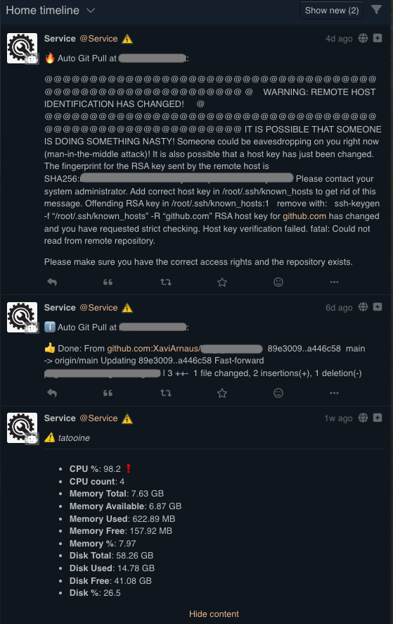

# Janitor
Bot in Python that collects system metrics and publishes them via a Mastodon-like API in case of crossing thresholds. Also publishes arbitrary messages in a client-server API fashion for generic monitoring.

[](https://github.com/XaviArnaus/janitor/actions/workflows/tests.yml)
[](https://github.com/XaviArnaus/janitor/actions/workflows/yapf.yml)
[](https://github.com/XaviArnaus/janitor/actions/workflows/flake8.yml)
---

# Requirements
- Python 3.9
- Poetry (`poetry-core>=1.5.2`)

# Dependencies
This Python app uses the following libraries:

## Execution
- `Mastodon.py`: Communication with the API of the Mastodon/Pleroma/Akkoma server of oyur preference
- `psutil`: To get some internal system metrics
- `strenum`: Enrich string Enums
- `flask` & `flask-restful`: Bring up an API for client-server communication
- `cronizer`: Parse cron timmings
- `pyxavi`: Encapsulate some common work

## Development
- `pytest`: Tests
- `pytest-cov`: Test coverage analysis
- `freezegun`: Datetime freezings for tests
- `yapf`: Autoformatter
- `flake8`: Linter
- `toml`: tom files support

# Installation

### 1. Clone the repository
```
git clone git@github.com:XaviArnaus/janitor.git
```

### 2. Move yourself to the directory
```
cd janitor
```

### 3. Settle your config from the example
```
cp config.yaml.dist config.yaml
```

### 4. Edit the new config file
```
nano config.yaml
```

### 5. Change the parameters that make sense to your configuration
Depending on how you'll want this bot instance to behave, there are some mandatory parameters to set up. The config file is quite well documented. Later on this document there are sections explaining which modes can be set, what are they and how to set them up. Still, here are some tips, and other params are just ok by default:

**Typical single mode instance**
This mode checks the system and publishes to the social media platform, but does not make use of the client-server functionality.
- `mastodon.api_base_url`: Sets the URL of the social media platform instance where the user that will publish the posts lives.
- `mastodon.instance_type`: The type of social media platform that it is. All of them use the Mastodon API, but for instances different from Mastodon we need to set up some extras. This is all abstracted with this parameter. Set `mastodon` for a Mastodon instance or `pleroma` for Pleroma or Akkoma.
- `mastodon.credentials.user`: Just set up the `user` and the `password` here. Will be used in the first run to generate the `user.secret` file and then these parameters can be cleared.
- `app.run_control.dry_run`: Set it to False when you're ready to start publishing. This lets you run the bot without an actual publishing.
- `status_post.content_type`: For Mastodon it needs to be `text/plain`. For Pleroma or Akkoma it can be any of the possible values defined in the comment.


**API Listener mode instance**
This mode publishes System Info reports and arbitrary messages that reach out thorugh the API endpoints, but does not collect own System Info data.

- All the parameters defined in the _single mode instance_ above.
- `app.service.listen`: What to listen. `host` at `0.0.0.0` listens from all IPs that reach out. `port` defines which port to listen to.

**Remote mode where this instance collects the data and sends it to an API**
This mode only collects the data and sends it away. Therefor, we only need to set up very basic parameters:
- `app.service.remote_url`: Where to send the collected data.
- `app.run_control.dry_run`: Set it to False when you're ready to start sending the data away. This lets you run the bot without an actual data sending.


### 6. Install all Python dependencies
```
make init
```

### 7. Create the app
For the publishing into the Mastodon-like servers we need first to log in and set up the credential files. This is only needed for the "single mode" and the "listener mode", as they are the only ones that publish to the Mastodon API.
```
make create_app
```

# Different run modes as per use case
This section explains the different ways we can have this bot running dependining on the use case

## Run in "local" mode, single mode instance
This is a typical run-all. Once we have the corresponding parameters set up (see the Installation point 5 above) it should be as simple as:
```
make run_local
```

If the parameter `logger.loglevel` is set to `20` (INFO), this is the usual output:
```
[2023-03-17 08:24:57,891] INFO     janitor Init Local Runner
[2023-03-17 08:24:57,891] INFO     janitor Run local app
[2023-03-17 08:24:58,893] INFO     janitor No issues found. Ending here.
```

## A client-server environment
This architecture has a host with one instance of this bot listening through some API endpoints and one or many other instance of this same bot sending data to it. Therefor we need to set up at least 2 hosts:

### Host that Listens
This host is in charge to spawn an API, listen for incoming reports, check the thresholds, format a message and publish it to the social media instance.

Basically it does the exact same job than the "local mode" but besides collecting the data it receives the data from a remote client.

Once we have the corresponding parameters set up (see the Installation point 5 above), run:
```
make listen
```
This spawns a small Flask server listening to the defined IP and Port. It runs in background so you could close the SSH window.

To finish the listener, you should discover what is the process ID and kill it.
This should give you the process. Get the ID from it. Let's say it is 1234:
```
ps aux | grep listen.py | grep -v grep
```

This kills the process ID
```
kill -9 1234
```

### Host that sends the collected data
This host is in charge to collect the local System metrics and send them to the listener.

It does nothing else, so that the parameters to set up are very minimal. Once we have the corresponding parameters set up (see the Installation point 5 above), run:
```
make run_remote
```

If the parameter `logger.loglevel` is set to `20`, this is the usual output:
```
[2023-03-17 08:24:57,891] INFO     janitor Init Remote Runner
[2023-03-17 08:24:57,891] INFO     janitor Run remote app
[2023-03-17 08:24:58,893] INFO     janitor Sending sys_data away
```

### Sending arbitrary messages
The Listener also accepts receiving arbitrary messages that will get published. It has an endpoint `message` that accepts a `POST` message with the following fields:
- `hostname`: Mandatory. Defines who sends the message.
- `message`: Mandatory. The message itself to publish
- `summary`: Optional. If present, the published post will have the `summary` as Spoiler Text, having this "show more" button.
- `message_type`: Optional. If present it will present an emoji according to the type of message (see the table below). If `summary` is also present, the emoji will appear in the beginning of the Spoiler Text, otherwise it will appear in the beginning of the main text.

| message_type | Emoji |
|---|---|
| `none` | (none) |
| `info` | ℹ️ |
| `warning` | ⚠️ |
| `error` | 🔥 |
| `alarm` | 🚨 |

To send a minimal message from a linux shell you could run something like:
```
curl -X POST -d "hostname=MyHostname&message=This+is+a+test+message" http://server:5000/message
```

You can also enrich it a bit more, like:
```
curl -X POST -d "hostname=MyHostname&message=This+is+the+deep+dump+of+the+incident&summary=We+had+an+warning!&message_type=warning" http://server:5000/message
```

## Setting it up as a Scheduled task (cron)
This is most likely the intended purpose of this bot, to run periodically. To easy the set up, and also intending to settle a set up for further implementations, there is another "scheduler" mode that can be used.

### 1. Define the schedule that should run
In the config file there is a `app.schedules` parameter that accepts a list of objects representing each task to perform:
- `name` is just to describe what is this task
- `when` is a `crontab` expression defining when this task will be triggered.
- `action` is one of the possible values: "sysinfo_local" or "sysinfo_remote", at this point.

### 2. Add our scheduler into the crontab
Yes, it is all moved by the crontab in your system. Once your crontab pings this scheduler, all the rest of the set up can be done here.

1. Edit the crontab in your system
```
crontab -e
```

2. Add the following line
```
* * * * * cd /path/to/the/repository/janitor; make scheduler
```

3. Save and exit.

Now every minute our scheduler is triggered and it will perform the tasks whenever it is needed.


# Other configuration
This bot is implemented thinking as much as possible about parametrization. The config file tries to be self explanatory. Still, here comes some sections explaining some of the bot's functionality.

## System Info thresholds
The System Info data gathering provides a set of metrics. Each metric is a value that can be analysed in case this value crosses a certain threshold. If so then we raise an alert.

The definition of these thresholds is done in the `system_info.thresholds` config file parameter. Every subobject works as follows:
- `[name_of_the_metric]`: The name of the metric is the key of the object. It is the metric that will be analysed.
- `value`: It is the threshold value against the what the metric is compared. **The comparison is greater than**.
- `message_type`: This is the level of severity of the raise we will do. It can be one of the following: "none", "info", "warning", "error" or "alarm", and will become a slighly different post template when publishing it.

The bot comes with 3 metric thresholds relating to the percentage of CPU, memory and disk. Technically, anything that can be compared in a _greather than_ way can be placed here. All default metrics are floats or integers, so one could add several thresholds.

## System Info metric titles
As we're publishing metrics in a social media instance, we can also replace the metric name string itself with a descriptive title. Set these titles in the `formatting.system_info.report_item_names_map` config file parameter.

## System Info human readable values
The values shown are "humanized". To add a metric in the list of execptions use the `formatting.system_info.human_readable_exceptions` list in the config file parameter. If you want to totally deactivate it then set `formatting.system_info.human_readable` to `False`

# Use cases examples
As explained in the section above [Different run modes as per use case](#different-run-modes-as-per-use-case) we can run this bot in a variety of ways depending on the behaviour we want to achieve. This section presents some useful examples to start using it straight away

## Local mode
Clone the repo, adjust the configuration and install the dependencies [as explained above](#installation). Be sure that your schedule item points the action to `run_local`. Then edit your crontab [as explained](#2-add-our-scheduler-into-the-crontab) to set up the scheduler.

## Client-Server mode
In both server and client machines, clone the repo, adjust the configuration and install the dependencies [as explained above](#installation). Be sure that you set up the host and port to listen. 

### In the Server machine
Run the `make listen` command [as explained](#host-that-listens).

### In the Client machine for a periodic check of system metrics
Be sure that your schedule item points the action to `run_remote`. Then edit your crontab [as explained](#2-add-our-scheduler-into-the-crontab) to set up the scheduler.

### In the client machine for an arbitrary message send
Here the things are a bit more interesting. You have most likely a script, maybe a bash script, that performs any particular job. You want to capture the output and to send the execution report (or not) to the listener to be published.

As an example, take a look at this "auto `git pull`" script:
```
#! /bin/bash

urlencode() {
  python3 -c 'import urllib.parse, sys; print(urllib.parse.quote(sys.argv[1], sys.argv[2]))' \
    "$1" "$urlencode_safe"
}

cd /var/www/folder/of-my-project
OUTPUT=$(git pull 2>&1)
ret=$?
if [ $ret -ne 0 ]; then
	encoded=$(urlencode "$OUTPUT")
        curl -X POST -d "hostname=Auto+Git+Pull+at+myhostname&message=$encoded&message_type=error" http://server:5000/message
else
	if [[ "$OUTPUT" != "Already up to date." ]]; then
		encoded=$(urlencode "$OUTPUT")
        	curl -X POST -d "hostname=Auto+Git+Pull+at+myhostname&message=👍+Done:+$encoded&message_type=info" http://server:5000/message
	fi
fi
```

This script just executes a normal `git pull` from which we capture the output and the returning code of it. Depending on the returning code we know if it worked or not, and then we send a message to the listener with an url-encoded text and a defined Message Type that will lead to a related emoji.
At the end of the day we only perform a POST CURL request to our listener with a defined set of parameters that will be posted in the Mastodon-API.


# How does it look like
In the following screenshot we have 3 examples of posts published into an Akkoma instance:


### Message 1: Error
This is an arbitrary message sent from the bash script above. It actually happened that [GitHub changed the RSA keys](https://github.blog/2023-03-23-we-updated-our-rsa-ssh-host-key/) and the bot captured the failure.

### Message 2: Info
This is another arbitrary message sent from the same bash script above. It only communicates that a `git pull` that carried on some changes was done successfully.

### Message 3: Warning
This is an example of a periodic check of system metrics that identified an excess of CPU usage, publishing the current metrics for further analysis.